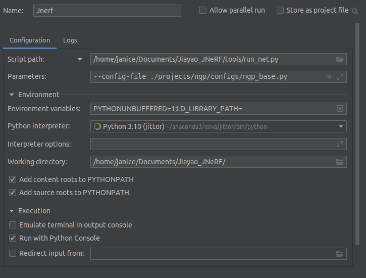

<!-- # JNeRF -->
<div align="center">

</div>

## Introduction
JNeRF is an NeRF benchmark based on [Jittor](https://github.com/Jittor/jittor). JNeRF supports Instant-NGP capable of training NeRF in 5 seconds and achieves similar performance and speed to the paper.

5s training demo of Instant-NGP implemented by JNeRF:


**Step 1: Install the requirements**
```shell
sudo apt-get install tcl-dev tk-dev python3-tk
git clone https://github.com/Jittor/JNeRF
cd JNeRF
python -m pip install -r requirements.txt
```
If you have any installation problems for Jittor, please refer to [Jittor](https://github.com/Jittor/jittor)

**Step 2: Install JNeRF**

JNeRF is a benchmark toolkit and can be updated frequently, so installing in editable mode is recommended.
Thus any modifications made to JNeRF will take effect without reinstallation.

```shell
cd python
python -m pip install -e .
```

After installation, you can ```import jnerf``` in python interpreter to check if it is successful or not.

## Getting Started

### Datasets

We use fox datasets and blender lego datasets for training demonstrations. 

#### Fox Dataset
We provided fox dataset (from [Instant-NGP](https://github.com/NVlabs/instant-ngp)) in this repository at `./data/fox`.

#### Lego Dataset
You can download the lego dataset in nerf_example_data.zip at https://drive.google.com/drive/folders/128yBriW1IG_3NJ5Rp7APSTZsJqdJdfc1. And move `lego` folder to `./data/lego`.

#### Customized Datasets

If you want to train JNerf with your own dataset, then you should follow the format of our datasets. You should split your datasets into training, validation and testing sets. Each set should be paired with a json file that describes the camera parameters of each images.

### Config

We organize our configs of JNeRF in projects/. You are referred to `./projects/ngp/configs/ngp_base.py` to learn how it works.

### Train from scratch

You can train from scratch on the `lego` scene with the following command. It should be noted that since jittor is a just-in-time compilation framework, it will take some time to compile on the first run.
```shell
python tools/run_net.py --config-file ./projects/ngp/configs/ngp_base.py
```
NOTE: Competitors participating in the Jittor AI Challenge can use `./projects/ngp/configs/ngp_comp.py` as config.

### Test with pre-trained model

After training, the ckpt file `params.pkl` will be automatically saved in `./logs/lego/`. And you can modify the ckpt file path by setting the `ckpt_path` in the config file. 

Set the `--task` of the command to `test` to test with pre-trained model:
```shell
python tools/run_net.py --config-file ./projects/ngp/configs/ngp_base.py --task test
```

### Render demo video

Set the `--task` of the command to `render` to render demo video `demo.mp4` with specified camera path based on pre-trained model:
```shell
python tools/run_net.py --config-file ./projects/ngp/configs/ngp_base.py --task render
```

## Config Files

* Everytime when I encounter some errors I do the following in order, it will always work!

1.   unset LD_LIBRARY_PATH

2.   python -m jittor

3.   python -m jittor_utils.install_cuda


* 
 

 ## How to add the deformation module


 